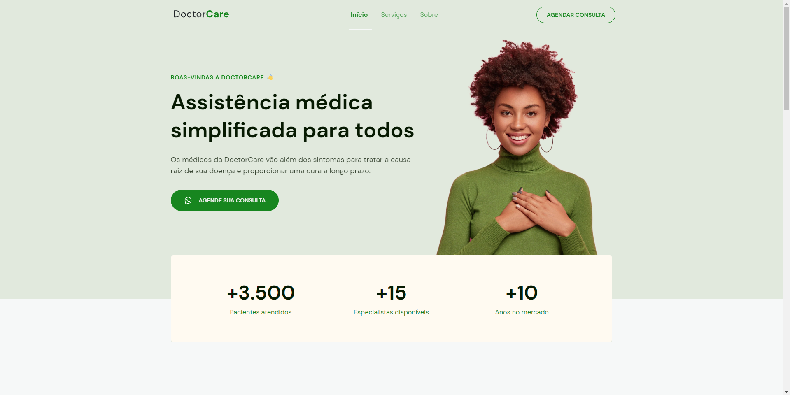

# DOCTORCARE - NLW RETURN

# Criando um site do zero

Projeto desenvolvido durante o nlw-return origin da Rocketseat. [Clique aqui para visitar a página](https://rafaelfrodz.github.io/nlwreturn-origin-rocketseat/)

## Objetivo

Aprender como estruturar um layout, técnicas de CSS3 com containers, variáveis e media query, e como utilizar o javascript para deixar o site mais interativo e animado.

## Screenshot do projeto no computador

## Screenshot do projeto no celular

## 🚀 Tecnologias e Ferramentas Utilizadas

**HTML5**

- Semântica

**CSS3**

- Responsividade

**JavaScript**

- ScrollReveal

**Desenvolvido por [Rafael César](https://github.com/rafaelfrodz/)**
